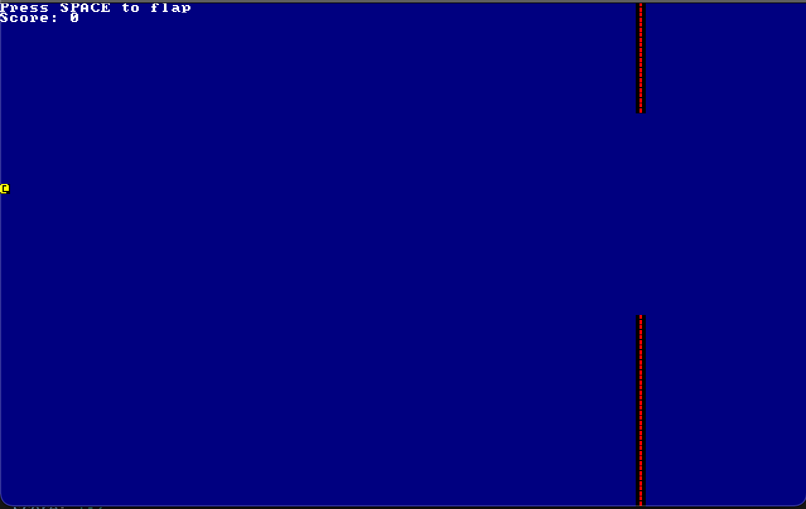

# Flappy Ascii

## Descrition

Siple flappy bird clone using `Rust` and `bracket-lib`

## Gameplay

Press SPACE bar to flap up and avoid colliding with columns

## How to run

To run the game you need to:

- [Install Rust compiler](https://rustup.rs/)
- Make sure that `cargo` command is available
- Move to the project directory
- Run `cargo run` command in your terminal
